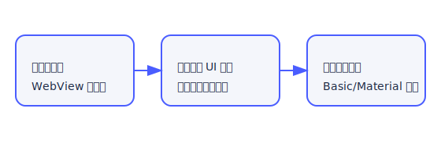

# ARIM RDE Tool 使用方法

> **対象バージョン**: v2.2.6 / 最終更新日 2025-12-13

## 1. 起動とログイン

1. `arim_rde_tool.exe` を実行するとメインウィンドウが立ち上がります。
2. 左メニューから **ログイン** タブを選択します。
3. 自動ログインを有効にしている場合は、そのままトークン取得プロセスが開始されます。
4. 停止した場合は **ログイン実行** ボタンで再試行できます。

### ヒント
- 自動ログインは「設定 → 自動ログイン」タブで認証情報を保存すると有効化できます。
- 企業プロキシ環境では事前に「設定 → プロキシ」でモードと証明書を整えてください。

## 2. 基本情報タブ

1. 「基本情報」タブで課題番号（例: `JPMXP1222TU0195`）を入力し **検索開始**。
2. 取得後に **まとめ XLSX** ボタンで Excel レポートを作成できます。
3. v2.2.4 以降では検索開始前に表示される **基本情報検索設定ダイアログ** で下記モードを選択できます。
   - 自分のデータセット: RDEユーザー名で検索し、直近の課題のみを抽出
   - キーワード手動入力: 任意の助成番号/課題番号をそのままキューへ追加
   - 機関ID + 年度レンジ: 助成番号プレフィックス + 機関IDを指定し、年度範囲からキーワードを自動生成（プレビュー付き）
4. まとめ XLSX 出力前に表示される「プロジェクトファイル選択」ダイアログで groupOrganizations / groupProjects / grants JSON を用途別に切り替えられます。
   - 既定JSONを一括で使う従来方式
   - JSON単位で分割し、必要な構成だけを出力
   - 外部JSONや `attributes.name` フィルタを混在させたカスタム構成
5. 複数ファイルを出力した場合は結果一覧ダイアログが自動表示され、任意のファイルを直接開けます。`まとめフォルダを開く` ボタンで Explorer を起動して出力フォルダへ移動できます。

## 3. データ取得

- 「データ取得」タブで対象データセットを選択し、画像や補助ファイルを並列ダウンロードできます。
- 進捗バーは **ファイルリスト取得 → ダウンロード実行** の 2 段階で表示されます。
- `output/rde/data/dataFiles` 以下に保存され、blob URL からのサムネイル展開も自動です。

## 4. データ登録 (タイル)

1. 「データ登録」タブでデータセットを選択。
2. ファイルをドラッグ＆ドロップ、またはリスト追加ボタンで登録します。
3. 並列アップロード数やタイムアウト値は画面下部で調整できます。
4. 進捗はファイル単位＋全体バーで確認できます。

## 5. AI 機能

- データセット開設/修正フォームの説明文欄で **AI 提案** ボタンを押すと候補が生成されます。
- 「AI設定」タブで API プロバイダー、モデル、抽出ルールを切り替え可能。
- ファイル抽出結果や structured JSON は `output/rde/data/datasetJsonChunks/` などにキャッシュされます。

## 6. 診断 / トラブルシューティング

| 症状 | チェック項目 |
| --- | --- |
| ログイン途中で停止 | プロキシ設定、WebView の JavaScript コンソール、`output/log/webview_log.html` |
| トークンエラー | 「設定 → トークン状態」で期限確認 → `手動リフレッシュ` |
| ダウンロード失敗 | `output/log/debug_trace.log` に出力される API 応答コードを確認 |
| AI 失敗 | API キー / モデル設定、ファイル抽出対象の拡張子、サイズ制限 |

## 7. ログ確認

- `output/log/` に主要ログが保存されます。
- WebView の HTML スナップショットは `webview_html/`、URL 履歴は `webview_url_log.txt` を参照してください。

## 8. ヘルプの更新について

この文書は `src/resources/docs/help/usage.md` を直接編集するだけで更新できます。画像は同フォルダの `images/` に配置し、Markdown から相対パスで参照してください。